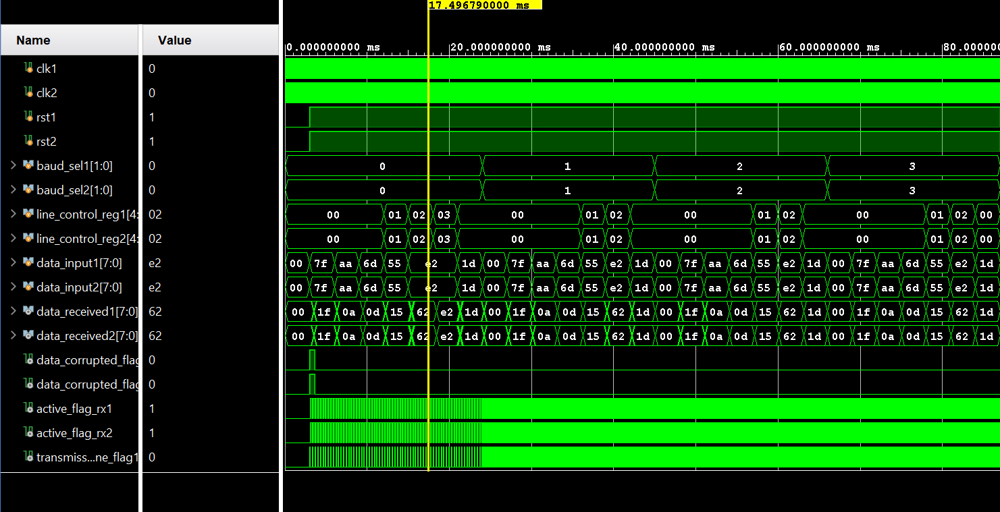

# UART (Universal Asynchronous Receiver-Transmitter)

## Description

This project implements a UART (Universal Asynchronous Receiver-Transmitter) module in Verilog. 
UART is a hardware communication protocol that uses asynchronous serial communication. 
It is widely used for serial communication between microcontrollers, computers, and other digital systems.

UART Schematic

UART Waveform

UART operating in full duplex configuaration

UART Full duplex configuaration waveform

### Components:
**Transmitter**: The transmitter consists of three components:
- Baud Clock Generator :
  - This generates the clock signal for the UART module based on the baud select bits.
  - The baud rate determines the speed of data transmission.
  - Both the transmitter and the receiver must agree on the baud rate.
- Control Unit :
  - The control unit takes the 8 bit parallel data to be transmitted and the line control register as inputs.
  - Based on the line control register, it generates the parity bit and constructs the data frame(with start and stop bits) which will be transmitted.
  - Just like the baud select bits, both the transmitter and the receiver must receive the same line control register so that parity generation and checking can happen. properly.
- PISO Shift Register :
  - Takes the parallel data frame from the control unit and transmitts it serially.

 
**Receiver**: The receiver also consists of three components:
- Baud Clock Generator :
  - Just like in the transmitter, here also it generates a baud clock.
- SIPO Shift Register :
  - Takes the serial data as an input from the transmitter and converts it into parallel data.
- Receiver Control Unit :
  - Takes the parallel data and checks the start,stop and parity bits to check the integrity of the data.
  - Outputs the 8 bit parallel data received.

## Features

- **Parity Checking**:
  - Supports optional parity bit for error detection.
  - Configurable for even or odd parity.

- **Data Width Selection**:
  - Allows selection of data width (typically 5, 6, 7, or 8 bits) .
  - Only transmitts the chosen amount of data and fills the rest of the data frame with zeroes.

- **Baud Rate Selection**:
  - Allows the selection of baud rate (2400,4800,9600 or 38400) with the help of baud select bits.

- **Full-Duplex Communication**:
  - Enables simultaneous transmission and reception of data.

- **Testbench Included**:
  - Created testbenches to ensure the functionality of each and every verilog code.

